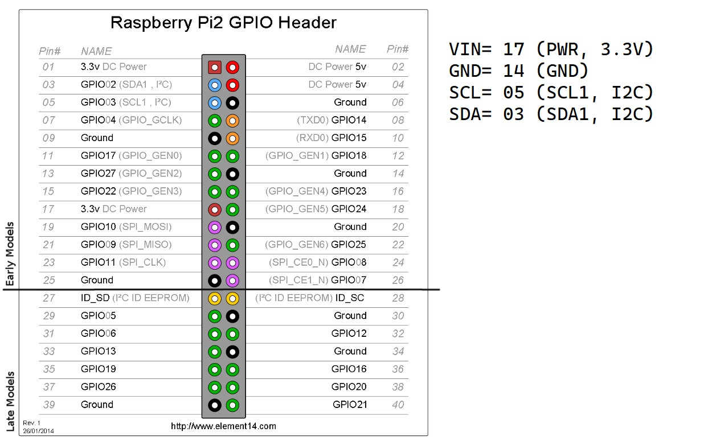

# Prometheus-BME280-exporter

A prometheus exporter for a BOSH BME280 sensor, this time, written in go :blue_heart:

## Wiring the sensor

VIN, GND, SCL and SDA are the notations on the sensor board of the GYBME280 sensor.

## ToDos

- :x: Implement basic implementation of prometheus exporter 
- :x: Implement ``/-/reload`` route 
- :x: Implement ``/metrics/json`` route for JSON population
- :x: Implement ``/healthz`` route for checking if the sensor is available
- :x: Use [urfave/cli](https://github.com/urfave/cli/blob/master/docs/v2/manual.md) as it is more lightwheight
- :x: Write tests, of course..
- :x: populate Inject version of app to api endpoint

## Libraries
- switch to https://github.com/tinygo-org/drivers

- https://github.com/bpicode/fritzctl/wiki/Prometheus-monitoring
- https://www.digitalocean.com/community/tutorials/using-ldflags-to-set-version-information-for-go-applications
- https://blog.alexellis.io/golang-writing-unit-tests/